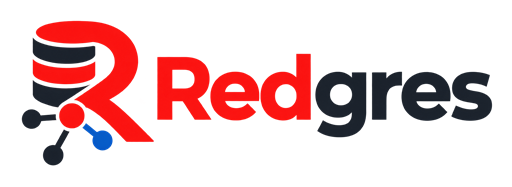

**One secure control plane for PostgreSQL and Redis.**  
Redgres is a Self-hosted database administration for a single PostgreSQL cluster and Redis instance.

Redgres is a self-hosted Go and React administration console for securely managing one PostgreSQL cluster and one Redis instance. It combines PostgreSQL project database provisioning, Redis ACL user management, credential-safe workflows, audit history, health monitoring, and protected links to expert tools in one operator-focused interface.

> [!WARNING]
> Redgres is under active development and is **not production accepted**. Do not retire an existing database console until the migration, recovery, compatibility, staging, and production gates are complete. See the evidence-backed [implementation matrix](docs/TRACEABILITY.md) and [acceptance checklist](docs/ACCEPTANCE_CHECKLIST.md).
